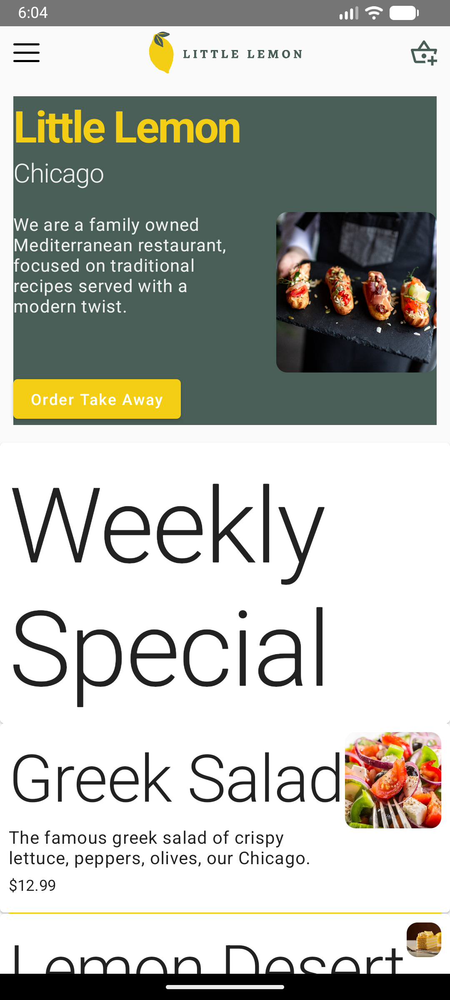
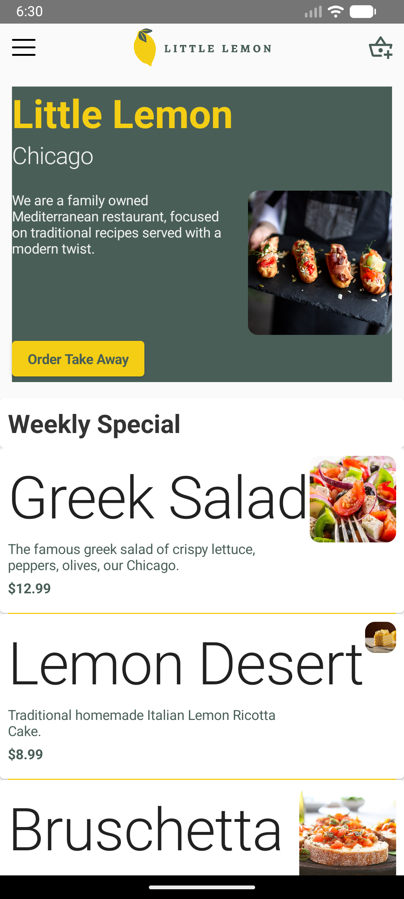
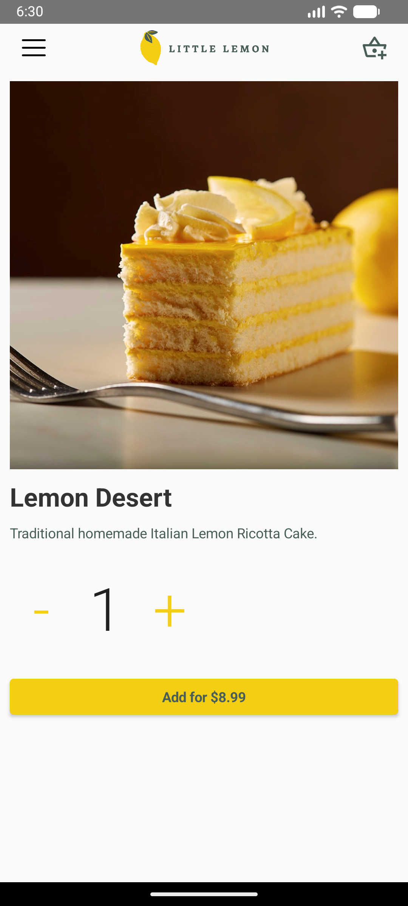

# Little Lemon UI with Kotlin

A modern Android application built with Kotlin and Jetpack Compose, featuring a restaurant menu interface for Little Lemon.

## Screenshots

### Home Screen



### Home Screen Alternative View



### Dish Details



### Navigation Demo

<video src="media/navigation&detail.webm" controls width="300"></video>

## Features

- **Modern UI**: Built with Jetpack Compose for a smooth, declarative UI experience
- **Navigation**: Single-activity app with Compose Navigation for seamless screen transitions
- **Menu Display**: Browse through various dishes with images, descriptions, and prices
- **Dish Details**: View detailed information about individual menu items
- **Responsive Design**: Optimized for different screen sizes and orientations

## Technologies Used

- **Kotlin** - Primary programming language
- **Jetpack Compose** - Modern UI toolkit for building native Android interfaces
- **Android Navigation Component** - For handling navigation between screens
- **Material Design 3** - Design system for consistent UI components
- **Android Gradle Plugin** - Build system

## Prerequisites

- **Android Studio** (latest stable version recommended)
- **Android SDK** API level 21 or higher
- **Java 8** or higher

## Installation & Setup

1. **Clone the repository:**

   ```bash
   git clone https://github.com/simiel/Little-Lemon-UI-with-Kotlin-Final-Project.git
   cd Little-Lemon-UI-with-Kotlin-Final-Project
   ```

2. **Open in Android Studio:**

   - Launch Android Studio
   - Select "Open an existing Android Studio project"
   - Navigate to the cloned directory and select it

3. **Sync Project:**
   - Android Studio should automatically sync the project
   - If not, click "Sync Project with Gradle Files" from the toolbar

## Build & Run

### Using Android Studio

1. Connect an Android device or start an emulator
2. Click the "Run" button (green play icon) in the toolbar
3. Select your target device
4. The app will be installed and launched automatically

### Using Command Line

```bash
# Build debug APK
./gradlew assembleDebug

# Install to connected device/emulator
./gradlew installDebug

# Run unit tests
./gradlew test

# Run instrumentation tests (requires connected device)
./gradlew connectedAndroidTest
```

## Project Structure

```
app/
├── src/main/
│   ├── AndroidManifest.xml          # App manifest
│   ├── java/com/example/littlelemon/ # Main source code
│   │   ├── MainActivity.kt          # Main activity with navigation
│   │   ├── HomeScreen.kt            # Home screen composable
│   │   ├── DishDetails.kt           # Dish details screen
│   │   ├── DishRepository.kt        # Data repository for dishes
│   │   ├── TopAppBar.kt             # Top app bar component
│   │   ├── UpperPanel.kt            # Upper panel component
│   │   ├── LowerPanel.kt            # Lower panel component
│   │   └── ui/theme/                # Theme files
│   │       ├── Color.kt
│   │       ├── Shape.kt
│   │       ├── Theme.kt
│   │       └── Type.kt
│   └── res/                         # Resources
│       ├── drawable/                # Images and icons
│       ├── mipmap-*/                # App icons
│       └── values/                  # Strings, colors, themes
├── build.gradle                     # App-level build configuration
└── proguard-rules.pro               # ProGuard rules

gradle/                              # Gradle wrapper
media/                               # Screenshots and demo videos
.github/                             # GitHub configuration
```

## Key Components

- **MainActivity**: Entry point with navigation setup using `NavHost`
- **DishRepository**: Static data source containing menu items
- **Navigation**: Uses Compose Navigation with route-based navigation
- **Theme**: Custom Material theme with Little Lemon branding

## Contributing

1. Fork the repository
2. Create a feature branch (`git checkout -b feature/amazing-feature`)
3. Commit your changes (`git commit -m 'Add some amazing feature'`)
4. Push to the branch (`git push origin feature/amazing-feature`)
5. Open a Pull Request

## License

This project is part of a learning course and is intended for educational purposes.

---

**Note**: This is a demonstration app showcasing Jetpack Compose and modern Android development practices.</content>
<parameter name="filePath">/Users/samuel/Downloads/C5M5L1 Item 05 Starter Code/README.md
